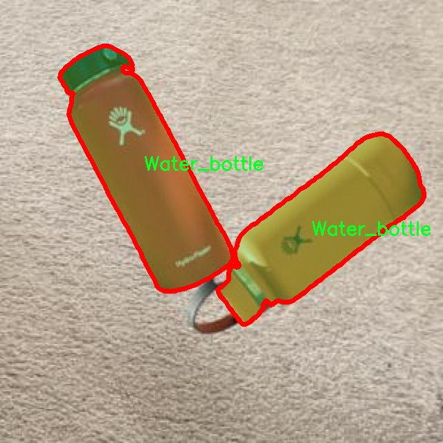
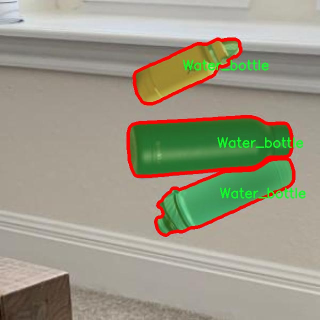

# 服装图像分割系统源码＆数据集分享
 [yolov8-seg-RevCol＆yolov8-seg-C2f-DAttention等50+全套改进创新点发刊_一键训练教程_Web前端展示]

### 1.研究背景与意义

项目参考[ILSVRC ImageNet Large Scale Visual Recognition Challenge](https://gitee.com/YOLOv8_YOLOv11_Segmentation_Studio/projects)

项目来源[AAAI Global Al lnnovation Contest](https://kdocs.cn/l/cszuIiCKVNis)

研究背景与意义

随着人工智能技术的迅猛发展，计算机视觉领域的应用逐渐渗透到各个行业，尤其是在时尚和服装行业，图像处理技术的应用潜力巨大。近年来，服装图像的自动识别与分割成为了研究的热点之一。传统的图像处理方法在处理复杂背景和多样化服装样式时，往往面临着准确性不足和效率低下的问题。因此，开发一种高效、准确的服装图像分割系统显得尤为重要。

YOLO（You Only Look Once）系列模型以其快速的检测速度和较高的准确率在目标检测领域取得了显著的成就。YOLOv8作为该系列的最新版本，进一步提升了模型的性能，尤其是在处理复杂场景和小目标检测方面表现出色。然而，尽管YOLOv8在目标检测上表现优异，但在服装图像的实例分割任务中，仍然存在一些不足之处，如对细节的捕捉能力和对不同服装类别的区分能力。因此，基于改进YOLOv8的服装图像分割系统的研究具有重要的理论价值和实际意义。

本研究将基于“Clothing 2.0”数据集进行模型的训练与测试。该数据集包含2100张图像，涵盖12个服装类别，包括包、棒球帽、杯子、连衣裙、帽子、卫衣、手机、长袖衬衫、毛衣、长袖T恤、短袖T恤和水瓶。这些类别的多样性为模型的训练提供了丰富的样本，有助于提升模型在实际应用中的泛化能力。通过对这些服装图像进行实例分割，可以有效地提取出每个服装对象的轮廓和特征，为后续的服装识别、推荐和虚拟试衣等应用奠定基础。

此外，随着电子商务和在线购物的普及，消费者对个性化和精准推荐的需求日益增加。服装图像分割技术的进步将直接推动智能推荐系统的发展，使得消费者能够更方便地找到符合自己风格的服装。同时，该技术还可以为服装设计师提供数据支持，帮助他们更好地理解市场趋势和消费者偏好，从而提升设计效率和市场竞争力。

在技术层面，改进YOLOv8的服装图像分割系统不仅能够提高分割精度，还能在实时性和计算效率上做出优化，适应移动设备和边缘计算的需求。这对于提升用户体验、降低计算成本具有重要意义。通过将深度学习与图像处理技术相结合，本研究将推动服装图像分析技术的进一步发展，为相关领域的研究提供新的思路和方法。

综上所述，基于改进YOLOv8的服装图像分割系统的研究，不仅具有重要的学术价值，也在实际应用中展现出广阔的前景。通过深入探索该领域的技术细节和应用场景，能够为服装行业的数字化转型提供有力支持，推动整个行业的创新与发展。

### 2.图片演示


##### 注意：由于此博客编辑较早，上面“2.图片演示”和“3.视频演示”展示的系统图片或者视频可能为老版本，新版本在老版本的基础上升级如下：（实际效果以升级的新版本为准）

  （1）适配了YOLOV8的“目标检测”模型和“实例分割”模型，通过加载相应的权重（.pt）文件即可自适应加载模型。

  （2）支持“图片识别”、“视频识别”、“摄像头实时识别”三种识别模式。

  （3）支持“图片识别”、“视频识别”、“摄像头实时识别”三种识别结果保存导出，解决手动导出（容易卡顿出现爆内存）存在的问题，识别完自动保存结果并导出到tempDir中。

  （4）支持Web前端系统中的标题、背景图等自定义修改，后面提供修改教程。

  另外本项目提供训练的数据集和训练教程,暂不提供权重文件（best.pt）,需要您按照教程进行训练后实现图片演示和Web前端界面演示的效果。

### 3.视频演示

[3.1 视频演示](https://www.bilibili.com/video/BV1s92VYTE8D/)

### 4.数据集信息展示

##### 4.1 本项目数据集详细数据（类别数＆类别名）

nc: 12
names: ['Bag', 'Baseball_hat', 'Cup', 'Dress', 'Hat', 'Hoodies', 'Mobile_phone', 'Shirt_long', 'Sweater', 'Tee_long', 'Tee_short', 'Water_bottle']


##### 4.2 本项目数据集信息介绍

数据集信息展示

在本研究中，我们采用了名为“Clothing 2.0”的数据集，以训练和改进YOLOv8-seg模型，旨在提升服装图像分割系统的性能。该数据集专门针对服装及相关配件的图像分割任务而设计，包含了丰富的标注信息和多样化的样本，能够有效支持深度学习模型的训练与评估。

“Clothing 2.0”数据集包含12个类别，涵盖了日常生活中常见的服装及配件。这些类别包括：Bag（包）、Baseball_hat（棒球帽）、Cup（杯子）、Dress（连衣裙）、Hat（帽子）、Hoodies（连帽衫）、Mobile_phone（手机）、Shirt_long（长袖衬衫）、Sweater（毛衣）、Tee_long（长袖T恤）、Tee_short（短袖T恤）和Water_bottle（水瓶）。这些类别的选择不仅体现了现代时尚的多样性，也为模型提供了丰富的训练样本，使其能够更好地适应不同的服装类型和场景。

数据集中的图像经过精心挑选和标注，确保每个类别的样本数量充足且具有代表性。每个图像都配有相应的分割掩码，标明了不同类别的区域。这种高质量的标注为YOLOv8-seg模型的训练提供了可靠的基础，使其能够在分割任务中准确识别和区分不同的服装及配件。此外，数据集中的图像涵盖了多种拍摄角度、光照条件和背景环境，进一步增强了模型的泛化能力。

在训练过程中，我们将“Clothing 2.0”数据集划分为训练集、验证集和测试集，以确保模型在不同阶段的学习和评估都能够得到有效的支持。训练集用于模型的参数优化，验证集用于调整超参数和防止过拟合，而测试集则用于最终的性能评估。通过这种划分，我们能够全面了解模型在实际应用中的表现，并针对性地进行改进。

值得一提的是，随着时尚行业的快速发展，服装种类和风格不断变化，因此“Clothing 2.0”数据集的设计也考虑到了这一点。数据集的更新和扩展将有助于保持模型的适应性，使其能够及时反映最新的时尚趋势和消费者需求。这种动态更新的机制为研究者和开发者提供了更大的灵活性，能够在快速变化的市场环境中保持竞争力。

总之，“Clothing 2.0”数据集为改进YOLOv8-seg的服装图像分割系统提供了坚实的基础。通过丰富的类别、多样的样本和高质量的标注，该数据集不仅提升了模型的训练效果，也为未来的研究和应用奠定了良好的基础。我们期待通过这一数据集的深入研究，推动服装图像分割技术的发展，为时尚行业的智能化转型贡献力量。






### 5.全套项目环境部署视频教程（零基础手把手教学）

[5.1 环境部署教程链接（零基础手把手教学）](https://www.bilibili.com/video/BV1jG4Ve4E9t/?vd_source=bc9aec86d164b67a7004b996143742dc)


[5.2 安装Python虚拟环境创建和依赖库安装视频教程链接（零基础手把手教学）](https://www.bilibili.com/video/BV1nA4VeYEze/?vd_source=bc9aec86d164b67a7004b996143742dc)

### 6.手把手YOLOV8-seg训练视频教程（零基础小白有手就能学会）

[6.1 手把手YOLOV8-seg训练视频教程（零基础小白有手就能学会）](https://www.bilibili.com/video/BV1cA4VeYETe/?vd_source=bc9aec86d164b67a7004b996143742dc)


按照上面的训练视频教程链接加载项目提供的数据集，运行train.py即可开始训练



     Epoch   gpu_mem       box       obj       cls    labels  img_size
     1/200     0G   0.01576   0.01955  0.007536        22      1280: 100%|██████████| 849/849 [14:42<00:00,  1.04s/it]
               Class     Images     Labels          P          R     mAP@.5 mAP@.5:.95: 100%|██████████| 213/213 [01:14<00:00,  2.87it/s]
                 all       3395      17314      0.994      0.957      0.0957      0.0843

     Epoch   gpu_mem       box       obj       cls    labels  img_size
     2/200     0G   0.01578   0.01923  0.007006        22      1280: 100%|██████████| 849/849 [14:44<00:00,  1.04s/it]
               Class     Images     Labels          P          R     mAP@.5 mAP@.5:.95: 100%|██████████| 213/213 [01:12<00:00,  2.95it/s]
                 all       3395      17314      0.996      0.956      0.0957      0.0845

     Epoch   gpu_mem       box       obj       cls    labels  img_size
     3/200     0G   0.01561    0.0191  0.006895        27      1280: 100%|██████████| 849/849 [10:56<00:00,  1.29it/s]
               Class     Images     Labels          P          R     mAP@.5 mAP@.5:.95: 100%|███████   | 187/213 [00:52<00:00,  4.04it/s]
                 all       3395      17314      0.996      0.957      0.0957      0.0845


### 7.50+种全套YOLOV8-seg创新点代码加载调参视频教程（一键加载写好的改进模型的配置文件）

[7.1 50+种全套YOLOV8-seg创新点代码加载调参视频教程（一键加载写好的改进模型的配置文件）](https://www.bilibili.com/video/BV1Hw4VePEXv/?vd_source=bc9aec86d164b67a7004b996143742dc)

### 8.YOLOV8-seg图像分割算法原理

原始YOLOv8-seg算法原理

YOLOv8-seg算法是YOLO系列中的最新成员，代表了目标检测和图像分割领域的前沿技术。与其前身YOLOv5相比，YOLOv8在多个方面实现了显著的提升，尤其是在检测精度和处理速度上。该算法的设计理念是通过优化网络结构和改进损失计算方法，以满足实时性和高精度的双重需求。YOLOv8-seg不仅继承了YOLO系列的优良传统，还在此基础上进行了创新，特别是在图像分割任务中的应用，使其在处理复杂场景时表现得更加出色。

YOLOv8的网络结构可以分为四个主要部分：输入端、骨干网络、颈部网络和头部网络。输入端的设计采用了马赛克数据增强、自适应锚框计算和自适应灰度填充等技术，这些技术的结合不仅提高了数据的多样性，还增强了模型对不同输入图像的适应能力。马赛克数据增强通过将多张图像拼接在一起，生成更为复杂的训练样本，从而提高了模型的鲁棒性。自适应锚框计算则根据输入图像的特征动态调整锚框的大小和数量，确保模型能够更好地捕捉到目标物体的特征。

在骨干网络部分，YOLOv8引入了C2f模块和空间金字塔池化融合（SPPF）结构。C2f模块的设计灵感来源于YOLOv7的ELAN结构，通过增加分支和跨层连接，增强了特征的梯度流动性。这种设计使得模型能够更有效地学习到残差特征，进而提升了特征表示能力。SPPF结构则通过多尺度特征融合，增强了模型对不同尺度目标的检测能力，使得YOLOv8在处理复杂场景时能够更为精准地识别和分割目标。

颈部网络采用了路径聚合网络（PAN）结构，这一结构的引入极大地增强了不同尺度特征的融合能力。PAN通过在不同层次之间进行特征传递，使得高层特征与低层特征能够有效结合，从而提高了模型对小目标的检测能力。这一设计理念在YOLOv8-seg中尤为重要，因为图像分割任务往往需要对细节进行精确处理，PAN的特性使得YOLOv8-seg能够在保持高效性的同时，提供更为细致的分割结果。

头部网络的设计是YOLOv8-seg的另一个重要创新点。与传统的耦合头结构不同，YOLOv8采用了解耦头结构，将分类和检测过程分开处理。这一改进使得模型在进行目标检测时，能够更加专注于分类和回归任务，从而提高了整体性能。此外，YOLOv8还引入了无锚框检测头，减少了锚框预测的数量，显著加快了非最大抑制（NMS）过程。这一系列的改进，使得YOLOv8-seg在面对复杂背景和多目标场景时，能够保持高效的处理速度和准确的分割效果。

在损失计算方面，YOLOv8-seg采用了Task-Aligned Assigner分配策略，根据分类与回归的分数加权结果选择正样本。这一策略的引入使得模型在训练过程中能够更有效地分配样本，提高了正负样本的平衡性，从而提升了模型的学习效率。在损失计算中，分类分支使用了二元交叉熵损失（BCELoss），而回归分支则结合了分布焦点损失（DFLoss）和完全交并比损失函数（CIOULoss），这些损失函数的选择旨在提升模型对边界框预测的精准性，确保分割结果的高质量。

YOLOv8-seg的优势不仅体现在其结构设计和损失计算上，还在于其灵活的模型选择。YOLOv8根据不同的应用场景，提供了n、s、m、l、x等多种模型版本，以满足不同用户对速度和精度的需求。尤其是YOLOv8n版本，以其最小的参数量和最快的检测速度，成为了实时应用的理想选择。这种灵活性使得YOLOv8-seg能够广泛应用于智能监控、自动驾驶、医疗影像分析等多个领域，展现出其强大的适应能力和实用价值。

总的来说，YOLOv8-seg算法通过一系列创新的设计和优化，不仅提升了目标检测和图像分割的性能，还为实际应用提供了更为高效和灵活的解决方案。其在实时性、精度和适应性方面的优势，使得YOLOv8-seg成为当前目标检测和图像分割领域的佼佼者，预示着未来在计算机视觉技术发展中的广阔前景。


### 9.系统功能展示（检测对象为举例，实际内容以本项目数据集为准）

图9.1.系统支持检测结果表格显示

  图9.2.系统支持置信度和IOU阈值手动调节

  图9.3.系统支持自定义加载权重文件best.pt(需要你通过步骤5中训练获得)

  图9.4.系统支持摄像头实时识别

  图9.5.系统支持图片识别

  图9.6.系统支持视频识别

  图9.7.系统支持识别结果文件自动保存

  图9.8.系统支持Excel导出检测结果数据


### 10.50+种全套YOLOV8-seg创新点原理讲解（非科班也可以轻松写刊发刊，V11版本正在科研待更新）

#### 10.1 由于篇幅限制，每个创新点的具体原理讲解就不一一展开，具体见下列网址中的创新点对应子项目的技术原理博客网址【Blog】：


[10.1 50+种全套YOLOV8-seg创新点原理讲解链接](https://gitee.com/qunmasj/good)

#### 10.2 部分改进模块原理讲解(完整的改进原理见上图和技术博客链接)【如果此小节的图加载失败可以通过CSDN或者Github搜索该博客的标题访问原始博客，原始博客图片显示正常】

### YOLOv8简介

按照官方描述，YOLOv8 是一个 SOTA 模型，它建立在以前 YOLO 版本的成功基础上，并引入了新的功能和改进，以进一步提升性能和灵活性。具体创新包括一个新的骨干网络、一个新的 Ancher-Free 检测头和一个新的损失函数，可以在从 CPU 到 GPU 的各种硬件平台上运行。

不过 ultralytics 并没有直接将开源库命名为 YOLOv8，而是直接使用 ultralytics 这个词，原因是 ultralytics 将这个库定位为算法框架，而非某一个特定算法，一个主要特点是可扩展性。其希望这个库不仅仅能够用于 YOLO 系列模型，而是能够支持非 YOLO 模型以及分类分割姿态估计等各类任务。
总而言之，ultralytics 开源库的两个主要优点是：

融合众多当前 SOTA 技术于一体
未来将支持其他 YOLO 系列以及 YOLO 之外的更多算法


下表为官方在 COCO Val 2017 数据集上测试的 mAP、参数量和 FLOPs 结果。可以看出 YOLOv8 相比 YOLOv5 精度提升非常多，但是 N/S/M 模型相应的参数量和 FLOPs 都增加了不少，从上图也可以看出相比 YOLOV5 大部分模型推理速度变慢了。


额外提一句，现在各个 YOLO 系列改进算法都在 COCO 上面有明显性能提升，但是在自定义数据集上面的泛化性还没有得到广泛验证，至今依然听到不少关于 YOLOv5 泛化性能较优异的说法。对各系列 YOLO 泛化性验证也是 MMYOLO 中一个特别关心和重点发力的方向。

### YOLO-MS简介
实时目标检测，以YOLO系列为例，已在工业领域中找到重要应用，特别是在边缘设备（如无人机和机器人）中。与之前的目标检测器不同，实时目标检测器旨在在速度和准确性之间追求最佳平衡。为了实现这一目标，提出了大量的工作：从第一代DarkNet到CSPNet，再到最近的扩展ELAN，随着性能的快速增长，实时目标检测器的架构经历了巨大的变化。

尽管性能令人印象深刻，但在不同尺度上识别对象仍然是实时目标检测器面临的基本挑战。这促使作者设计了一个强大的编码器架构，用于学习具有表现力的多尺度特征表示。具体而言，作者从两个新的角度考虑为实时目标检测编码多尺度特征：

从局部视角出发，作者设计了一个具有简单而有效的分层特征融合策略的MS-Block。受到Res2Net的启发，作者在MS-Block中引入了多个分支来进行特征提取，但不同的是，作者使用了一个带有深度卷积的 Inverted Bottleneck Block块，以实现对大Kernel的高效利用。

从全局视角出发，作者提出随着网络加深逐渐增加卷积的Kernel-Size。作者在浅层使用小Kernel卷积来更高效地处理高分辨率特征。另一方面，在深层中，作者采用大Kernel卷积来捕捉广泛的信息。

基于以上设计原则，作者呈现了作者的实时目标检测器，称为YOLO-MS。为了评估作者的YOLO-MS的性能，作者在MS COCO数据集上进行了全面的实验。还提供了与其他最先进方法的定量比较，以展示作者方法的强大性能。如图1所示，YOLO-MS在计算性能平衡方面优于其他近期的实时目标检测器。


具体而言，YOLO-MS-XS在MS COCO上获得了43%+的AP得分，仅具有450万个可学习参数和8.7亿个FLOPs。YOLO-MS-S和YOLO-MS分别获得了46%+和51%+的AP，可学习参数分别为810万和2220万。此外，作者的工作还可以作为其他YOLO模型的即插即用模块。通常情况下，作者的方法可以将YOLOv8的AP从37%+显著提高到40%+，甚至还可以使用更少的参数和FLOPs。


#### Multi-Scale Building Block Design
CSP Block是一个基于阶段级梯度路径的网络，平衡了梯度组合和计算成本。它是广泛应用于YOLO系列的基本构建块。已经提出了几种变体，包括YOLOv4和YOLOv5中的原始版本，Scaled YOLOv4中的CSPVoVNet，YOLOv7中的ELAN，以及RTMDet中提出的大Kernel单元。作者在图2(a)和图2(b)中分别展示了原始CSP块和ELAN的结构。


上述实时检测器中被忽视的一个关键方面是如何在基本构建块中编码多尺度特征。其中一个强大的设计原则是Res2Net，它聚合了来自不同层次的特征以增强多尺度表示。然而，这一原则并没有充分探索大Kernel卷积的作用，而大Kernel卷积已经在基于CNN的视觉识别任务模型中证明有效。将大Kernel卷积纳入Res2Net的主要障碍在于它们引入的计算开销，因为构建块采用了标准卷积。在作者的方法中，作者提出用 Inverted Bottleneck Block替代标准的3 × 3卷积，以享受大Kernel卷积的好处。

基于前面的分析，作者提出了一个带有分层特征融合策略的全新Block，称为MS-Block，以增强实时目标检测器在提取多尺度特征时的能力，同时保持快速的推理速度。

MS-Block的具体结构如图2(c)所示。假设是输入特征。通过1×1卷积的转换后，X的通道维度增加到n*C。然后，作者将X分割成n个不同的组，表示为，其中。为了降低计算成本，作者选择n为3。

注意，除了之外，每个其他组都经过一个 Inverted Bottleneck Block层，用表示，其中k表示Kernel-Size，以获得。的数学表示如下：


根据这个公式，该博客的作者不将 Inverted Bottleneck Block层连接，使其作为跨阶段连接，并保留来自前面层的信息。最后，作者将所有分割连接在一起，并应用1×1卷积来在所有分割之间进行交互，每个分割都编码不同尺度的特征。当网络加深时，这个1×1卷积也用于调整通道数。

#### Heterogeneous Kernel Selection Protocol
除了构建块的设计外，作者还从宏观角度探讨了卷积的使用。之前的实时目标检测器在不同的编码器阶段采用了同质卷积（即具有相同Kernel-Size的卷积），但作者认为这不是提取多尺度语义信息的最佳选项。

在金字塔结构中，从检测器的浅阶段提取的高分辨率特征通常用于捕捉细粒度语义，将用于检测小目标。相反，来自网络较深阶段的低分辨率特征用于捕捉高级语义，将用于检测大目标。如果作者在所有阶段都采用统一的小Kernel卷积，深阶段的有效感受野（ERF）将受到限制，影响大目标的性能。在每个阶段中引入大Kernel卷积可以帮助解决这个问题。然而，具有大的ERF的大Kernel可以编码更广泛的区域，这增加了在小目标外部包含噪声信息的概率，并且降低了推理速度。

在这项工作中，作者建议在不同阶段中采用异构卷积，以帮助捕获更丰富的多尺度特征。具体来说，在编码器的第一个阶段中，作者采用最小Kernel卷积，而最大Kernel卷积位于最后一个阶段。随后，作者逐步增加中间阶段的Kernel-Size，使其与特征分辨率的增加保持一致。这种策略允许提取细粒度和粗粒度的语义信息，增强了编码器的多尺度特征表示能力。

正如图所示，作者将k的值分别分配给编码器中的浅阶段到深阶段，取值为3、5、7和9。作者将其称为异构Kernel选择（HKS）协议。


作者的HKS协议能够在深层中扩大感受野，而不会对浅层产生任何其他影响。此外，HKS不仅有助于编码更丰富的多尺度特征，还确保了高效的推理。

如表1所示，将大Kernel卷积应用于高分辨率特征会产生较高的计算开销。然而，作者的HKS协议在低分辨率特征上采用大Kernel卷积，从而与仅使用大Kernel卷积相比，大大降低了计算成本。


在实践中，作者经验性地发现，采用HKS协议的YOLO-MS的推理速度几乎与仅使用深度可分离的3 × 3卷积相同。

#### Architecture
如图所示，作者模型的Backbone由4个阶段组成，每个阶段后面跟随1个步长为2的3 × 3卷积进行下采样。在第3个阶段后，作者添加了1个SPP块，与RTMDet中一样。在作者的编码器上，作者使用PAFPN作为Neck来构建特征金字塔[31, 35]。它融合了从Backbone不同阶段提取的多尺度特征。Neck中使用的基本构建块也是作者的MS-Block，在其中使用3 × 3深度可分离卷积进行快速推理。

此外，为了在速度和准确性之间取得更好的平衡，作者将Backbone中多级特征的通道深度减半。作者提供了3个不同尺度的YOLO-MS变体，即YOLO-MS-XS、YOLO-MS-S和YOLO-MS。不同尺度的YOLO-MS的详细配置列在表2中。对于YOLO-MS的其他部分，作者将其保持与RTMDet相同。


### 11.项目核心源码讲解（再也不用担心看不懂代码逻辑）

#### 11.1 ultralytics\models\yolo\pose\train.py

以下是对给定代码的核心部分进行分析和详细注释的结果：

```python
# Ultralytics YOLO 🚀, AGPL-3.0 license

from copy import copy
from ultralytics.models import yolo
from ultralytics.nn.tasks import PoseModel
from ultralytics.utils import DEFAULT_CFG, LOGGER
from ultralytics.utils.plotting import plot_images, plot_results

class PoseTrainer(yolo.detect.DetectionTrainer):
    """
    PoseTrainer类扩展了DetectionTrainer类，用于基于姿态模型的训练。
    """

    def __init__(self, cfg=DEFAULT_CFG, overrides=None, _callbacks=None):
        """初始化PoseTrainer对象，使用指定的配置和覆盖参数。"""
        if overrides is None:
            overrides = {}
        overrides['task'] = 'pose'  # 设置任务类型为姿态估计
        super().__init__(cfg, overrides, _callbacks)  # 调用父类构造函数

        # 检查设备是否为Apple MPS，若是则发出警告
        if isinstance(self.args.device, str) and self.args.device.lower() == 'mps':
            LOGGER.warning("WARNING ⚠️ Apple MPS known Pose bug. Recommend 'device=cpu' for Pose models. "
                           'See https://github.com/ultralytics/ultralytics/issues/4031.')

    def get_model(self, cfg=None, weights=None, verbose=True):
        """获取指定配置和权重的姿态估计模型。"""
        # 创建PoseModel实例
        model = PoseModel(cfg, ch=3, nc=self.data['nc'], data_kpt_shape=self.data['kpt_shape'], verbose=verbose)
        if weights:
            model.load(weights)  # 加载权重

        return model  # 返回模型

    def set_model_attributes(self):
        """设置PoseModel的关键点形状属性。"""
        super().set_model_attributes()  # 调用父类方法
        self.model.kpt_shape = self.data['kpt_shape']  # 设置关键点形状

    def get_validator(self):
        """返回PoseValidator类的实例以进行验证。"""
        self.loss_names = 'box_loss', 'pose_loss', 'kobj_loss', 'cls_loss', 'dfl_loss'  # 定义损失名称
        return yolo.pose.PoseValidator(self.test_loader, save_dir=self.save_dir, args=copy(self.args))  # 返回验证器实例

    def plot_training_samples(self, batch, ni):
        """绘制一批训练样本，包括标注的类别标签、边界框和关键点。"""
        images = batch['img']  # 获取图像
        kpts = batch['keypoints']  # 获取关键点
        cls = batch['cls'].squeeze(-1)  # 获取类别
        bboxes = batch['bboxes']  # 获取边界框
        paths = batch['im_file']  # 获取图像文件路径
        batch_idx = batch['batch_idx']  # 获取批次索引

        # 绘制图像并保存
        plot_images(images,
                    batch_idx,
                    cls,
                    bboxes,
                    kpts=kpts,
                    paths=paths,
                    fname=self.save_dir / f'train_batch{ni}.jpg',
                    on_plot=self.on_plot)

    def plot_metrics(self):
        """绘制训练/验证指标。"""
        plot_results(file=self.csv, pose=True, on_plot=self.on_plot)  # 保存结果图像
```

### 代码分析
1. **PoseTrainer类**：这是一个用于姿态估计训练的类，继承自YOLO的DetectionTrainer类，专门用于处理姿态模型的训练过程。
2. **初始化方法**：构造函数中设置了任务类型为“pose”，并处理了特定设备（如Apple MPS）的警告。
3. **获取模型**：`get_model`方法用于创建和加载姿态模型，支持指定配置和权重。
4. **设置模型属性**：`set_model_attributes`方法设置了模型的关键点形状。
5. **获取验证器**：`get_validator`方法返回用于验证的PoseValidator实例，并定义了损失名称。
6. **绘制训练样本**：`plot_training_samples`方法用于可视化训练样本，包括图像、关键点和边界框。
7. **绘制指标**：`plot_metrics`方法用于绘制训练和验证过程中的指标。

这些核心部分构成了PoseTrainer类的主要功能，支持姿态估计模型的训练和验证。

这个文件是Ultralytics YOLO框架中的一个用于姿态估计训练的Python脚本，文件名为`train.py`。它定义了一个名为`PoseTrainer`的类，该类继承自`DetectionTrainer`，专门用于处理与姿态模型相关的训练任务。

在类的构造函数`__init__`中，首先会初始化一些配置参数。如果没有提供覆盖参数，则会创建一个空字典，并将任务类型设置为“pose”。然后调用父类的构造函数进行初始化。如果检测到设备是Apple的MPS（Metal Performance Shaders），则会发出警告，建议使用CPU进行姿态模型的训练，以避免已知的兼容性问题。

`get_model`方法用于获取姿态估计模型。它会根据提供的配置和权重加载一个`PoseModel`实例，并返回该模型。模型的输入通道数、类别数和关键点形状都是根据数据集的配置进行设置的。

`set_model_attributes`方法用于设置模型的关键点形状属性，确保模型在训练时能够正确处理关键点数据。

`get_validator`方法返回一个`PoseValidator`实例，用于模型验证。它会设置损失名称，包括边界框损失、姿态损失、关键点对象损失、类别损失和分布式焦点损失等。

`plot_training_samples`方法用于可视化一批训练样本。它会提取图像、关键点、类别和边界框信息，并使用`plot_images`函数将这些信息绘制出来，生成的图像会保存到指定的目录中。

最后，`plot_metrics`方法用于绘制训练和验证过程中的指标，使用`plot_results`函数生成结果图像，并保存为`results.png`。

总体来说，这个文件实现了姿态估计模型的训练流程，包括模型的初始化、训练样本的可视化和训练过程中的指标绘制等功能，便于用户进行姿态估计任务的训练和分析。

#### 11.2 ui.py

以下是经过简化和注释的核心代码部分：

```python
import sys
import subprocess

def run_script(script_path):
    """
    使用当前 Python 环境运行指定的脚本。

    Args:
        script_path (str): 要运行的脚本路径

    Returns:
        None
    """
    # 获取当前 Python 解释器的路径
    python_path = sys.executable

    # 构建运行命令，使用 streamlit 运行指定的脚本
    command = f'"{python_path}" -m streamlit run "{script_path}"'

    # 执行命令，并等待其完成
    result = subprocess.run(command, shell=True)
    
    # 检查命令执行的返回码，如果不为0，表示出错
    if result.returncode != 0:
        print("脚本运行出错。")

# 主程序入口
if __name__ == "__main__":
    # 指定要运行的脚本路径
    script_path = "web.py"  # 这里可以直接指定脚本路径

    # 调用函数运行脚本
    run_script(script_path)
```

### 代码注释说明：
1. **导入模块**：
   - `sys`：用于获取当前 Python 解释器的路径。
   - `subprocess`：用于执行外部命令。

2. **run_script 函数**：
   - 接受一个参数 `script_path`，表示要运行的 Python 脚本的路径。
   - 使用 `sys.executable` 获取当前 Python 解释器的路径。
   - 构建一个命令字符串，用于通过 `streamlit` 运行指定的脚本。
   - 使用 `subprocess.run` 执行构建的命令，并等待其完成。
   - 检查命令的返回码，如果返回码不为0，打印错误信息。

3. **主程序入口**：
   - 当脚本作为主程序运行时，指定要运行的脚本路径，并调用 `run_script` 函数执行该脚本。

这个程序文件的主要功能是通过当前的 Python 环境来运行一个指定的脚本，具体是一个名为 `web.py` 的文件。程序首先导入了必要的模块，包括 `sys`、`os` 和 `subprocess`，这些模块提供了与系统交互的功能。

在 `run_script` 函数中，首先获取当前 Python 解释器的路径，这样可以确保使用正确的 Python 环境来执行脚本。接着，构建一个命令字符串，该命令使用 `streamlit` 模块来运行指定的脚本。`streamlit` 是一个用于构建数据应用的流行库，通常用于快速创建和分享数据应用。

使用 `subprocess.run` 方法来执行构建好的命令，这个方法会在新的进程中运行命令，并等待其完成。命令执行后，程序会检查返回码，如果返回码不为零，表示脚本运行过程中出现了错误，程序会打印出“脚本运行出错”的提示信息。

在文件的最后部分，使用 `if __name__ == "__main__":` 语句来确保只有在直接运行该文件时才会执行后面的代码。这里指定了要运行的脚本路径为 `web.py`，并调用 `run_script` 函数来执行该脚本。

总的来说，这个程序的设计目的是为了方便地在当前 Python 环境中运行一个特定的脚本，并能够处理运行过程中可能出现的错误。

#### 11.3 ultralytics\utils\errors.py

```python
# 导入ultralytics.utils模块中的emojis函数，用于处理消息中的表情符号
from ultralytics.utils import emojis

# 自定义异常类，用于处理与Ultralytics YOLO模型获取相关的错误
class HUBModelError(Exception):
    """
    自定义异常类，用于处理与模型获取相关的错误。

    当请求的模型未找到或无法检索时，将引发此异常。
    消息经过处理，以包含表情符号，从而改善用户体验。

    属性:
        message (str): 当异常被引发时显示的错误消息。

    注意:
        消息会通过'ultralytics.utils'包中的'emojis'函数自动处理。
    """

    def __init__(self, message='Model not found. Please check model URL and try again.'):
        """创建一个模型未找到的异常。"""
        # 调用父类的构造函数，并将处理过的消息传递给它
        super().__init__(emojis(message))
``` 

### 代码核心部分说明：
1. **异常类定义**：`HUBModelError`类继承自Python内置的`Exception`类，用于定义一个特定的异常类型。
2. **构造函数**：`__init__`方法接收一个消息参数，默认值为“模型未找到，请检查模型URL并重试。”，并通过`emojis`函数处理该消息，以便在用户界面中显示表情符号。
3. **异常处理**：当模型无法找到时，可以通过抛出`HUBModelError`异常来通知用户，提供更友好的错误信息。


#### 11.3 train.py

以下是经过简化和注释的核心代码部分：

```python
import os
import torch
import yaml
from ultralytics import YOLO  # 导入YOLO模型库

if __name__ == '__main__':  # 确保该模块被直接运行时才执行以下代码
    # 设置训练参数
    workers = 1  # 数据加载的工作进程数
    batch = 8  # 每个批次的样本数量
    device = "0" if torch.cuda.is_available() else "cpu"  # 检查是否有可用的GPU

    # 获取数据集配置文件的绝对路径
    data_path = abs_path(f'datasets/data/data.yaml', path_type='current')

    # 将路径格式转换为Unix风格
    unix_style_path = data_path.replace(os.sep, '/')
    # 获取数据集目录路径
    directory_path = os.path.dirname(unix_style_path)

    # 读取YAML文件，保持原有顺序
    with open(data_path, 'r') as file:
        data = yaml.load(file, Loader=yaml.FullLoader)

    # 修改数据集路径
    if 'train' in data and 'val' in data and 'test' in data:
        data['train'] = directory_path + '/train'  # 设置训练集路径
        data['val'] = directory_path + '/val'      # 设置验证集路径
        data['test'] = directory_path + '/test'    # 设置测试集路径

        # 将修改后的数据写回YAML文件
        with open(data_path, 'w') as file:
            yaml.safe_dump(data, file, sort_keys=False)

    # 加载YOLO模型配置和预训练权重
    model = YOLO(r"C:\codeseg\codenew\50+种YOLOv8算法改进源码大全和调试加载训练教程（非必要）\改进YOLOv8模型配置文件\yolov8-seg-C2f-Faster.yaml").load("./weights/yolov8s-seg.pt")

    # 开始训练模型
    results = model.train(
        data=data_path,  # 指定训练数据的配置文件路径
        device=device,    # 指定训练使用的设备
        workers=workers,  # 指定数据加载的工作进程数
        imgsz=640,        # 指定输入图像的大小为640x640
        epochs=100,       # 指定训练的轮数为100
        batch=batch,      # 指定每个批次的样本数量
    )
```

### 代码注释说明：
1. **导入必要的库**：引入了操作系统、PyTorch、YAML解析库和YOLO模型库。
2. **主程序入口**：使用`if __name__ == '__main__':`确保只有在直接运行该脚本时才执行后续代码。
3. **设置训练参数**：定义了数据加载的工作进程数、批次大小和设备类型（GPU或CPU）。
4. **获取数据集配置文件路径**：使用`abs_path`函数获取数据集的YAML配置文件的绝对路径。
5. **读取和修改YAML文件**：读取YAML文件内容，更新训练、验证和测试集的路径，并将修改后的内容写回文件。
6. **加载YOLO模型**：指定模型配置文件和预训练权重进行模型加载。
7. **训练模型**：调用`model.train`方法开始训练，传入数据路径、设备、工作进程数、图像大小、训练轮数和批次大小等参数。

这个程序文件 `train.py` 是一个用于训练 YOLO（You Only Look Once）模型的脚本，主要使用了 PyTorch 和 Ultralitycs 库。程序的核心功能是加载数据集、配置模型并开始训练。

首先，程序导入了必要的库，包括 `os`、`torch`、`yaml` 和 `matplotlib`。其中，`YOLO` 是从 `ultralytics` 库中导入的，用于处理 YOLO 模型。`abs_path` 函数用于获取文件的绝对路径，确保路径的正确性。

在 `if __name__ == '__main__':` 这一部分，程序首先设置了一些训练参数，包括工作进程数 `workers`、批次大小 `batch` 和设备 `device`。设备的选择是基于是否有可用的 GPU（CUDA），如果没有则使用 CPU。

接下来，程序通过 `abs_path` 函数获取数据集配置文件 `data.yaml` 的绝对路径，并将其转换为 UNIX 风格的路径。然后，使用 `os.path.dirname` 获取该路径的目录部分。接着，程序打开 YAML 文件并读取其内容，使用 `yaml.load` 方法保持原有顺序。

程序检查 YAML 文件中是否包含 `train`、`val` 和 `test` 三个键，如果存在，则更新这些键的值为相应的训练、验证和测试数据的路径。修改完成后，程序将更新后的数据写回到 YAML 文件中，确保数据路径的正确性。

在模型加载部分，程序使用指定的配置文件路径加载 YOLO 模型。注释中提到，不同的模型对设备的要求不同，因此如果遇到错误，可以尝试使用其他模型配置文件。

最后，程序调用 `model.train` 方法开始训练模型，传入的数据配置文件路径、设备、工作进程数、输入图像大小、训练轮数和批次大小等参数。训练过程将在指定的设备上进行，使用的图像大小为 640x640，训练轮数为 100，批次大小为 8。

整体而言，这个脚本为 YOLO 模型的训练提供了一个完整的流程，从数据准备到模型训练的各个步骤都进行了相应的设置和处理。

#### 11.4 ultralytics\utils\triton.py

以下是保留的核心代码部分，并附上详细的中文注释：

```python
import numpy as np
from urllib.parse import urlsplit

class TritonRemoteModel:
    """
    与远程Triton推理服务器模型交互的客户端。

    属性:
        endpoint (str): Triton服务器上模型的名称。
        url (str): Triton服务器的URL。
        triton_client: Triton客户端（HTTP或gRPC）。
        InferInput: Triton客户端的输入类。
        InferRequestedOutput: Triton客户端的输出请求类。
        input_formats (List[str]): 模型输入的数据类型。
        np_input_formats (List[type]): 模型输入的numpy数据类型。
        input_names (List[str]): 模型输入的名称。
        output_names (List[str]): 模型输出的名称。
    """

    def __init__(self, url: str, endpoint: str = '', scheme: str = ''):
        """
        初始化TritonRemoteModel。

        参数可以单独提供或从一个集合的'url'参数解析，格式为
            <scheme>://<netloc>/<endpoint>/<task_name>

        参数:
            url (str): Triton服务器的URL。
            endpoint (str): Triton服务器上模型的名称。
            scheme (str): 通信方案（'http'或'gRPC'）。
        """
        # 如果没有提供endpoint和scheme，则从URL字符串中解析所有参数
        if not endpoint and not scheme:
            splits = urlsplit(url)  # 解析URL
            endpoint = splits.path.strip('/').split('/')[0]  # 获取模型名称
            scheme = splits.scheme  # 获取通信方案
            url = splits.netloc  # 获取网络位置

        self.endpoint = endpoint  # 设置模型名称
        self.url = url  # 设置服务器URL

        # 根据通信方案选择Triton客户端
        if scheme == 'http':
            import tritonclient.http as client  # 导入HTTP客户端
            self.triton_client = client.InferenceServerClient(url=self.url, verbose=False, ssl=False)
            config = self.triton_client.get_model_config(endpoint)  # 获取模型配置
        else:
            import tritonclient.grpc as client  # 导入gRPC客户端
            self.triton_client = client.InferenceServerClient(url=self.url, verbose=False, ssl=False)
            config = self.triton_client.get_model_config(endpoint, as_json=True)['config']  # 获取模型配置

        # 按字母顺序排序输出名称，例如'output0', 'output1'等
        config['output'] = sorted(config['output'], key=lambda x: x.get('name'))

        # 定义模型属性
        type_map = {'TYPE_FP32': np.float32, 'TYPE_FP16': np.float16, 'TYPE_UINT8': np.uint8}  # 数据类型映射
        self.InferRequestedOutput = client.InferRequestedOutput  # 设置输出请求类
        self.InferInput = client.InferInput  # 设置输入类
        self.input_formats = [x['data_type'] for x in config['input']]  # 获取输入数据类型
        self.np_input_formats = [type_map[x] for x in self.input_formats]  # 获取numpy数据类型
        self.input_names = [x['name'] for x in config['input']]  # 获取输入名称
        self.output_names = [x['name'] for x in config['output']]  # 获取输出名称

    def __call__(self, *inputs: np.ndarray) -> List[np.ndarray]:
        """
        使用给定的输入调用模型。

        参数:
            *inputs (List[np.ndarray]): 模型的输入数据。

        返回:
            List[np.ndarray]: 模型输出。
        """
        infer_inputs = []  # 初始化输入列表
        input_format = inputs[0].dtype  # 获取输入数据类型
        for i, x in enumerate(inputs):
            # 如果输入数据类型与预期不符，则转换数据类型
            if x.dtype != self.np_input_formats[i]:
                x = x.astype(self.np_input_formats[i])
            # 创建InferInput对象并设置数据
            infer_input = self.InferInput(self.input_names[i], [*x.shape], self.input_formats[i].replace('TYPE_', ''))
            infer_input.set_data_from_numpy(x)  # 从numpy数组设置数据
            infer_inputs.append(infer_input)  # 添加到输入列表

        # 创建输出请求对象
        infer_outputs = [self.InferRequestedOutput(output_name) for output_name in self.output_names]
        # 调用Triton客户端进行推理
        outputs = self.triton_client.infer(model_name=self.endpoint, inputs=infer_inputs, outputs=infer_outputs)

        # 返回输出结果，转换为原始输入数据类型
        return [outputs.as_numpy(output_name).astype(input_format) for output_name in self.output_names]
```

### 代码注释说明：
1. **类和属性**：`TritonRemoteModel`类用于与Triton推理服务器的模型进行交互，定义了模型的基本属性，如`endpoint`、`url`等。
2. **初始化方法**：`__init__`方法用于初始化类的实例，解析URL并设置通信方案，选择合适的Triton客户端，并获取模型的输入输出配置。
3. **调用方法**：`__call__`方法允许使用模型进行推理，接受numpy数组作为输入，处理输入数据，创建推理请求，并返回模型的输出结果。

这个程序文件是一个用于与远程Triton推理服务器模型交互的客户端类，名为`TritonRemoteModel`。该类的主要功能是通过HTTP或gRPC协议与Triton服务器进行通信，进行模型推理。

在类的文档字符串中，详细描述了类的属性，包括模型的名称、服务器的URL、Triton客户端、输入输出格式及其名称等。这些属性为后续的推理操作提供了必要的信息。

在初始化方法`__init__`中，类接受三个参数：`url`、`endpoint`和`scheme`。如果没有提供`endpoint`和`scheme`，则会从`url`中解析出这些信息。解析后的`endpoint`是模型在Triton服务器上的名称，`url`是服务器的地址，`scheme`则指明了通信协议（HTTP或gRPC）。根据`scheme`的不同，程序会导入相应的Triton客户端库，并获取模型的配置。

模型配置的获取包括输入输出的名称和数据类型。输入和输出的名称会被存储在`input_names`和`output_names`属性中，而输入数据类型则会被存储在`input_formats`和`np_input_formats`中，后者将数据类型映射为NumPy格式。

类的`__call__`方法允许用户以函数调用的方式使用模型。该方法接受多个NumPy数组作为输入，首先会检查输入数据的类型是否与模型要求的类型一致，如果不一致，则会进行类型转换。然后，程序会为每个输入创建一个`InferInput`对象，并将数据设置到这些对象中。接着，程序会创建输出请求对象，并调用Triton客户端的`infer`方法进行推理。最后，返回的输出结果会被转换为NumPy数组格式并返回。

总体而言，这个类提供了一种简洁的方式来与Triton推理服务器进行交互，方便用户进行模型推理。

#### 11.5 ultralytics\models\rtdetr\predict.py

以下是代码中最核心的部分，并附上详细的中文注释：

```python
import torch
from ultralytics.data.augment import LetterBox
from ultralytics.engine.predictor import BasePredictor
from ultralytics.engine.results import Results
from ultralytics.utils import ops

class RTDETRPredictor(BasePredictor):
    """
    RT-DETR（实时检测变换器）预测器，扩展了BasePredictor类，用于使用百度的RT-DETR模型进行预测。
    该类利用视觉变换器的强大功能，提供实时物体检测，同时保持高精度。
    支持高效的混合编码和IoU感知查询选择等关键特性。
    """

    def postprocess(self, preds, img, orig_imgs):
        """
        对模型的原始预测结果进行后处理，以生成边界框和置信度分数。

        该方法根据置信度和类进行过滤，若在`self.args`中指定。

        参数:
            preds (torch.Tensor): 模型的原始预测结果。
            img (torch.Tensor): 处理后的输入图像。
            orig_imgs (list或torch.Tensor): 原始未处理的图像。

        返回:
            (list[Results]): 包含后处理的边界框、置信度分数和类标签的Results对象列表。
        """
        # 获取预测结果的维度
        nd = preds[0].shape[-1]
        # 将预测结果分割为边界框和分数
        bboxes, scores = preds[0].split((4, nd - 4), dim=-1)

        # 如果原始图像不是列表，则转换为numpy数组
        if not isinstance(orig_imgs, list):
            orig_imgs = ops.convert_torch2numpy_batch(orig_imgs)

        results = []
        for i, bbox in enumerate(bboxes):  # 遍历每个边界框
            # 将边界框从xywh格式转换为xyxy格式
            bbox = ops.xywh2xyxy(bbox)
            # 获取当前边界框的最大分数和对应的类
            score, cls = scores[i].max(-1, keepdim=True)
            # 根据置信度过滤
            idx = score.squeeze(-1) > self.args.conf
            # 如果指定了类，则进一步过滤
            if self.args.classes is not None:
                idx = (cls == torch.tensor(self.args.classes, device=cls.device)).any(1) & idx
            # 过滤后的预测结果
            pred = torch.cat([bbox, score, cls], dim=-1)[idx]
            orig_img = orig_imgs[i]
            oh, ow = orig_img.shape[:2]  # 获取原始图像的高度和宽度
            # 将预测的边界框坐标缩放到原始图像的尺寸
            pred[..., [0, 2]] *= ow
            pred[..., [1, 3]] *= oh
            img_path = self.batch[0][i]  # 获取图像路径
            # 将结果添加到列表中
            results.append(Results(orig_img, path=img_path, names=self.model.names, boxes=pred))
        return results

    def pre_transform(self, im):
        """
        在将输入图像输入模型进行推理之前，对其进行预处理。
        输入图像被调整为方形长宽比并填充。大小必须是方形（640）并且填充比例正确。

        参数:
            im (list[np.ndarray] | torch.Tensor): 输入图像，形状为(N,3,h,w)的张量，或[(h,w,3) x N]的列表。

        返回:
            (list): 预处理后的图像列表，准备进行模型推理。
        """
        # 创建LetterBox对象以进行图像调整
        letterbox = LetterBox(self.imgsz, auto=False, scaleFill=True)
        # 对每个图像进行调整并返回
        return [letterbox(image=x) for x in im]
```

### 代码核心部分说明：
1. **RTDETRPredictor类**：这是一个用于实时物体检测的预测器，继承自`BasePredictor`类，主要用于处理和预测图像中的物体。
2. **postprocess方法**：对模型的原始预测结果进行后处理，生成最终的边界框和置信度分数，并根据置信度和类进行过滤。
3. **pre_transform方法**：对输入图像进行预处理，以确保它们适合模型输入，调整为方形并进行填充。

这个程序文件是一个用于实时目标检测的预测器，名为`RTDETRPredictor`，它继承自`BasePredictor`类，专门用于使用百度的RT-DETR模型进行预测。RT-DETR模型结合了视觉变换器的优势，能够在保持高精度的同时实现实时目标检测。该类支持高效的混合编码和IoU（Intersection over Union）感知查询选择等关键特性。

在文件中，首先导入了必要的库和模块，包括`torch`、数据增强的`LetterBox`、基本预测器`BasePredictor`、结果处理的`Results`以及一些实用操作`ops`。接着，定义了`RTDETRPredictor`类，并在类文档中提供了简要的说明和使用示例，展示了如何初始化预测器并进行预测。

类中有两个主要的方法：`postprocess`和`pre_transform`。`postprocess`方法用于对模型的原始预测结果进行后处理，以生成边界框和置信度分数。该方法首先从模型的输出中分离出边界框和分数，然后根据置信度和指定的类别进行过滤。对于每个检测到的边界框，方法会将其坐标从相对坐标转换为绝对坐标，并将结果封装成`Results`对象，最终返回一个包含所有检测结果的列表。

`pre_transform`方法则用于在将输入图像传递给模型进行推理之前，对其进行预处理。具体来说，它使用`LetterBox`类将输入图像调整为方形，并确保填充比例正确。该方法接受的输入可以是一个图像列表或一个张量，返回的是经过预处理的图像列表，准备好供模型进行推理。

总的来说，这个文件实现了一个高效的目标检测预测器，能够处理输入图像并生成准确的检测结果，适用于实时应用场景。

#### 11.6 ultralytics\models\rtdetr\train.py

以下是代码中最核心的部分，并附上详细的中文注释：

```python
# 导入必要的库
from copy import copy
import torch
from ultralytics.models.yolo.detect import DetectionTrainer
from ultralytics.nn.tasks import RTDETRDetectionModel
from ultralytics.utils import RANK, colorstr
from .val import RTDETRDataset, RTDETRValidator

class RTDETRTrainer(DetectionTrainer):
    """
    RT-DETR模型的训练类，专为百度开发的实时目标检测而设计。
    该类扩展了YOLO的DetectionTrainer，以适应RT-DETR的特定特性和架构。
    RT-DETR模型利用了视觉变换器，并具备IoU感知查询选择和可调推理速度等能力。
    """

    def get_model(self, cfg=None, weights=None, verbose=True):
        """
        初始化并返回一个用于目标检测任务的RT-DETR模型。

        参数:
            cfg (dict, optional): 模型配置，默认为None。
            weights (str, optional): 预训练模型权重的路径，默认为None。
            verbose (bool): 如果为True，则输出详细日志，默认为True。

        返回:
            (RTDETRDetectionModel): 初始化后的模型。
        """
        # 创建RT-DETR检测模型
        model = RTDETRDetectionModel(cfg, nc=self.data['nc'], verbose=verbose and RANK == -1)
        # 如果提供了权重，则加载权重
        if weights:
            model.load(weights)
        return model

    def build_dataset(self, img_path, mode='val', batch=None):
        """
        构建并返回用于训练或验证的RT-DETR数据集。

        参数:
            img_path (str): 包含图像的文件夹路径。
            mode (str): 数据集模式，可以是'train'或'val'。
            batch (int, optional): 矩形训练的批量大小，默认为None。

        返回:
            (RTDETRDataset): 特定模式的数据集对象。
        """
        # 创建RT-DETR数据集对象
        return RTDETRDataset(img_path=img_path,
                             imgsz=self.args.imgsz,
                             batch_size=batch,
                             augment=mode == 'train',  # 训练模式下进行数据增强
                             hyp=self.args,
                             rect=False,
                             cache=self.args.cache or None,
                             prefix=colorstr(f'{mode}: '),  # 为模式添加前缀
                             data=self.data)

    def get_validator(self):
        """
        返回适合RT-DETR模型验证的DetectionValidator。

        返回:
            (RTDETRValidator): 用于模型验证的验证器对象。
        """
        self.loss_names = 'giou_loss', 'cls_loss', 'l1_loss'  # 定义损失名称
        return RTDETRValidator(self.test_loader, save_dir=self.save_dir, args=copy(self.args))

    def preprocess_batch(self, batch):
        """
        预处理一批图像。对图像进行缩放并转换为浮点格式。

        参数:
            batch (dict): 包含一批图像、边界框和标签的字典。

        返回:
            (dict): 预处理后的批次数据。
        """
        # 调用父类的预处理方法
        batch = super().preprocess_batch(batch)
        bs = len(batch['img'])  # 批次大小
        batch_idx = batch['batch_idx']  # 批次索引
        gt_bbox, gt_class = [], []  # 初始化真实边界框和类别列表
        for i in range(bs):
            # 收集每个图像的真实边界框和类别
            gt_bbox.append(batch['bboxes'][batch_idx == i].to(batch_idx.device))
            gt_class.append(batch['cls'][batch_idx == i].to(device=batch_idx.device, dtype=torch.long))
        return batch  # 返回预处理后的批次数据
```

### 代码说明：
1. **类定义**：`RTDETRTrainer` 继承自 `DetectionTrainer`，专门用于训练 RT-DETR 模型。
2. **模型初始化**：`get_model` 方法用于创建和加载 RT-DETR 模型。
3. **数据集构建**：`build_dataset` 方法用于根据给定的图像路径和模式构建数据集。
4. **验证器获取**：`get_validator` 方法返回一个用于模型验证的验证器。
5. **批次预处理**：`preprocess_batch` 方法对输入的图像批次进行预处理，包括缩放和类型转换。

这个程序文件是用于训练RT-DETR模型的，RT-DETR是百度开发的一种实时目标检测模型。该文件继承自YOLO的DetectionTrainer类，并对其进行了适应性修改，以支持RT-DETR模型的特定特性和架构。RT-DETR模型利用了视觉变换器（Vision Transformers），并具备如IoU感知查询选择和可调推理速度等能力。

文件中包含多个方法，首先是`get_model`方法，它用于初始化并返回一个RT-DETR模型。该方法接受模型配置和预训练权重的路径作为参数，并在需要时加载权重。返回的模型是RTDETRDetectionModel的实例。

接下来是`build_dataset`方法，该方法用于构建并返回一个RT-DETR数据集，支持训练和验证模式。它接受图像路径、模式（训练或验证）和批次大小作为参数，并返回一个RTDETRDataset对象。该数据集会根据模式决定是否进行数据增强。

`get_validator`方法返回一个适用于RT-DETR模型验证的检测验证器（DetectionValidator）。在这个方法中，定义了损失名称，包括giou_loss、cls_loss和l1_loss，并返回RTDETRValidator的实例。

最后，`preprocess_batch`方法用于预处理一批图像。它将图像缩放并转换为浮点格式。该方法首先调用父类的预处理方法，然后根据批次索引将真实边界框和类别提取出来，并返回处理后的批次数据。

整体来看，这个文件提供了RT-DETR模型训练所需的主要功能，包括模型初始化、数据集构建、验证器获取和批次预处理等。通过这些功能，用户可以方便地进行模型训练和验证。

### 12.系统整体结构（节选）

### 程序整体功能和构架概括

该程序是一个基于Ultralytics框架的计算机视觉项目，主要用于目标检测和姿态估计任务。程序的架构分为多个模块，每个模块负责特定的功能，包括模型训练、预测、数据处理、错误管理和用户界面等。整体上，程序提供了一个完整的工作流，从数据准备、模型训练到推理和结果展示，旨在为用户提供高效、灵活的深度学习解决方案。

### 文件功能整理表

| 文件路径                                         | 功能描述                                                   |
|--------------------------------------------------|------------------------------------------------------------|
| `ultralytics/models/yolo/pose/train.py`         | 实现YOLO姿态估计模型的训练流程，包括数据加载、模型训练和结果可视化。 |
| `ui.py`                                         | 提供用户界面功能，允许用户通过图形界面与模型进行交互。       |
| `ultralytics/utils/errors.py`                   | 定义错误处理和异常管理的工具，帮助捕获和处理程序中的错误。   |
| `train.py`                                      | 负责模型的训练过程，包括数据配置、模型加载和训练参数设置。  |
| `ultralytics/utils/triton.py`                   | 提供与Triton推理服务器的交互接口，支持模型推理和结果获取。   |
| `ultralytics/models/rtdetr/predict.py`          | 实现RT-DETR模型的预测功能，包括输入预处理和后处理。         |
| `ultralytics/models/rtdetr/train.py`             | 负责RT-DETR模型的训练过程，包括数据准备和模型训练。        |
| `ultralytics/models/sam/predict.py`             | 实现SAM模型的预测功能，处理输入数据并生成检测结果。        |
| `ultralytics/nn/extra_modules/head.py`          | 定义模型的头部结构，处理特征图的输出和分类任务。            |
| `ultralytics/nn/extra_modules/orepa.py`         | 实现OREPA模块，增强模型的特征提取能力。                    |
| `ultralytics/utils/atss.py`                     | 实现ATSS（Adaptive Training Sample Selection）算法，优化训练样本选择。 |
| `ultralytics/nn/extra_modules/RFAConv.py`       | 定义RFA（Receptive Field Attention）卷积模块，增强模型的注意力机制。 |
| `ultralytics/nn/extra_modules/block.py`         | 定义基本的神经网络模块，构建模型的基础结构。                |

这个表格概述了每个文件的主要功能，帮助理解整个程序的架构和各个模块之间的关系。

注意：由于此博客编辑较早，上面“11.项目核心源码讲解（再也不用担心看不懂代码逻辑）”中部分代码可能会优化升级，仅供参考学习，完整“训练源码”、“Web前端界面”和“50+种创新点源码”以“14.完整训练+Web前端界面+50+种创新点源码、数据集获取”的内容为准。

### 13.图片、视频、摄像头图像分割Demo(去除WebUI)代码

在这个博客小节中，我们将讨论如何在不使用WebUI的情况下，实现图像分割模型的使用。本项目代码已经优化整合，方便用户将分割功能嵌入自己的项目中。
核心功能包括图片、视频、摄像头图像的分割，ROI区域的轮廓提取、类别分类、周长计算、面积计算、圆度计算以及颜色提取等。
这些功能提供了良好的二次开发基础。

### 核心代码解读

以下是主要代码片段，我们会为每一块代码进行详细的批注解释：

```python
import random
import cv2
import numpy as np
from PIL import ImageFont, ImageDraw, Image
from hashlib import md5
from model import Web_Detector
from chinese_name_list import Label_list

# 根据名称生成颜色
def generate_color_based_on_name(name):
    ......

# 计算多边形面积
def calculate_polygon_area(points):
    return cv2.contourArea(points.astype(np.float32))

...
# 绘制中文标签
def draw_with_chinese(image, text, position, font_size=20, color=(255, 0, 0)):
    image_pil = Image.fromarray(cv2.cvtColor(image, cv2.COLOR_BGR2RGB))
    draw = ImageDraw.Draw(image_pil)
    font = ImageFont.truetype("simsun.ttc", font_size, encoding="unic")
    draw.text(position, text, font=font, fill=color)
    return cv2.cvtColor(np.array(image_pil), cv2.COLOR_RGB2BGR)

# 动态调整参数
def adjust_parameter(image_size, base_size=1000):
    max_size = max(image_size)
    return max_size / base_size

# 绘制检测结果
def draw_detections(image, info, alpha=0.2):
    name, bbox, conf, cls_id, mask = info['class_name'], info['bbox'], info['score'], info['class_id'], info['mask']
    adjust_param = adjust_parameter(image.shape[:2])
    spacing = int(20 * adjust_param)

    if mask is None:
        x1, y1, x2, y2 = bbox
        aim_frame_area = (x2 - x1) * (y2 - y1)
        cv2.rectangle(image, (x1, y1), (x2, y2), color=(0, 0, 255), thickness=int(3 * adjust_param))
        image = draw_with_chinese(image, name, (x1, y1 - int(30 * adjust_param)), font_size=int(35 * adjust_param))
        y_offset = int(50 * adjust_param)  # 类别名称上方绘制，其下方留出空间
    else:
        mask_points = np.concatenate(mask)
        aim_frame_area = calculate_polygon_area(mask_points)
        mask_color = generate_color_based_on_name(name)
        try:
            overlay = image.copy()
            cv2.fillPoly(overlay, [mask_points.astype(np.int32)], mask_color)
            image = cv2.addWeighted(overlay, 0.3, image, 0.7, 0)
            cv2.drawContours(image, [mask_points.astype(np.int32)], -1, (0, 0, 255), thickness=int(8 * adjust_param))

            # 计算面积、周长、圆度
            area = cv2.contourArea(mask_points.astype(np.int32))
            perimeter = cv2.arcLength(mask_points.astype(np.int32), True)
            ......

            # 计算色彩
            mask = np.zeros(image.shape[:2], dtype=np.uint8)
            cv2.drawContours(mask, [mask_points.astype(np.int32)], -1, 255, -1)
            color_points = cv2.findNonZero(mask)
            ......

            # 绘制类别名称
            x, y = np.min(mask_points, axis=0).astype(int)
            image = draw_with_chinese(image, name, (x, y - int(30 * adjust_param)), font_size=int(35 * adjust_param))
            y_offset = int(50 * adjust_param)

            # 绘制面积、周长、圆度和色彩值
            metrics = [("Area", area), ("Perimeter", perimeter), ("Circularity", circularity), ("Color", color_str)]
            for idx, (metric_name, metric_value) in enumerate(metrics):
                ......

    return image, aim_frame_area

# 处理每帧图像
def process_frame(model, image):
    pre_img = model.preprocess(image)
    pred = model.predict(pre_img)
    det = pred[0] if det is not None and len(det)
    if det:
        det_info = model.postprocess(pred)
        for info in det_info:
            image, _ = draw_detections(image, info)
    return image

if __name__ == "__main__":
    cls_name = Label_list
    model = Web_Detector()
    model.load_model("./weights/yolov8s-seg.pt")

    # 摄像头实时处理
    cap = cv2.VideoCapture(0)
    while cap.isOpened():
        ret, frame = cap.read()
        if not ret:
            break
        ......

    # 图片处理
    image_path = './icon/OIP.jpg'
    image = cv2.imread(image_path)
    if image is not None:
        processed_image = process_frame(model, image)
        ......

    # 视频处理
    video_path = ''  # 输入视频的路径
    cap = cv2.VideoCapture(video_path)
    while cap.isOpened():
        ret, frame = cap.read()
        ......
```


### 14.完整训练+Web前端界面+50+种创新点源码、数据集获取


# [下载链接：https://mbd.pub/o/bread/ZpyZk51w](https://mbd.pub/o/bread/ZpyZk51w)